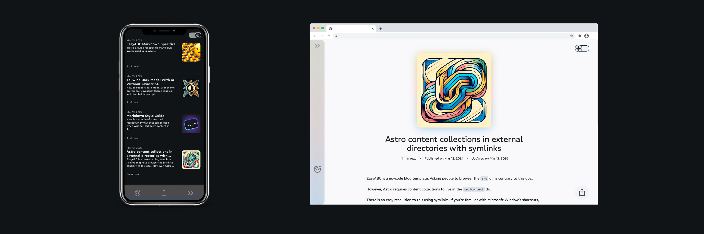
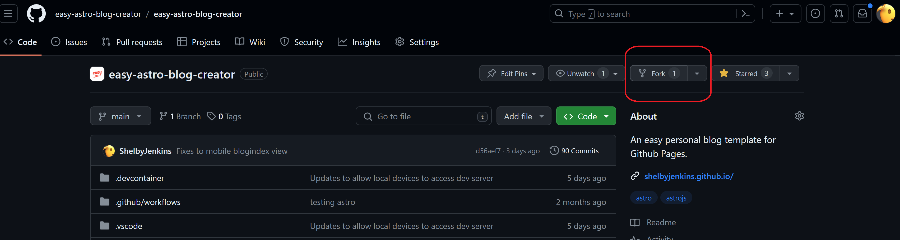
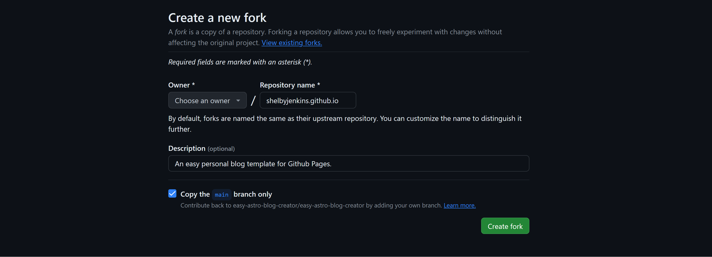
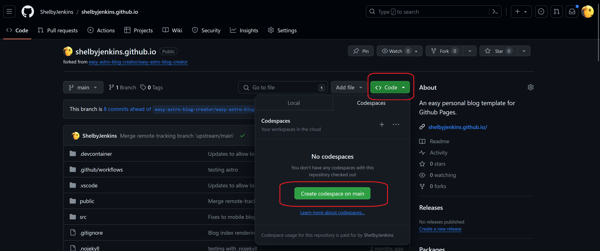
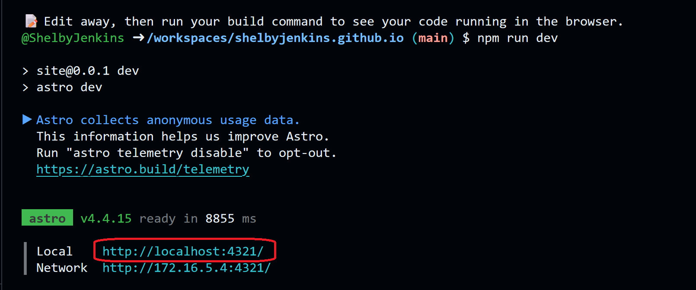

<h2> Easy Astro Blog Creator </h2>

> He not busy being born is busy dying

- Create for your life and beyond with complete control of your content.
- Free, using open source tools and professionally respected Github Pages.
- Easy no-code, in-browser user experience.
- Check out a live demo -> [EasyABC Live Demo](https://shelbyjenkins.github.io/)

<h3>Your first post online in 5m ⬇️</h3>

[Get started with the live documentation.](https://shelbyjenkins.github.io/easy/)

<h2>Setup</h2>

<h4>Your Github Repo</h4>

- Create a Github account.
- Fork [the repository](https://github.com/easy-astro-blog-creator/easy-astro-blog-creator):

- Name your repository with the format: `GITHUB_USERNAME.github.io`. <mark>This format must be used!</mark>
  - For example mine is `shelbyjenkins.github.io`.

- Create a codespace from your forked repo.

<h4>Preview the site</h4>

- It will take a 60-120s for the codespace to build for the first time. When it's done, a new terminal will automatically start and `npm run dev` will be run starting the local dev server for you.

- Click on the link in the terminal. This will open a local version of the site in your browser. You can use this to preview your changes.

  
<h2>Publish your Blog</h2>

<h4>Personalization</h4>

- Every setting you need to change along with instructions for them will be in `public/easyAbcUserConfig.ts`

<h4>Adding your content</h4>

- Your content will live in the `public/personal-blog/blog` folder.
  - By adding a a file to this folder, it will automatically be added to the blog.
- Use the `public/personal-blog/blog/template` as a starter by copying and pasting it to duplicate it. Then rename the folder and `.md` file inside it to match.
- Your new blog post will now be in your browser!
  - The template has more instructions for creating new posts. You can find [a live version of it here](https://shelbyjenkins.github.io/blog/template/).

<h4>Working with markdown</h4>

- Markdown is straight forward and you defintely use it in some form already. For example: Slack and Discord both use flavors of markdown.

- You can write in your favorite text editor and convert to markdown with tools like xyz and zyx.
  - For general markdown instructions see Astro's [general markdown guide](https://shelbyjenkins.github.io/easy/blog/markdown-style-guide/) for some notes.
  - And also the [EasyABC markdown specifics guide](https://shelbyjenkins.github.io/easy/blog/easy-a-b-c-markdown-specifics/).

<h4>Deploy to Github Pages</h4>

- In your Github repository go to the settings and find the pages panel.

  - Set the Source dropdown to Github Actions.

- Create your first commit and Push it!

  
<h2>Why</h2>

  <h4>No Paywalls and Walled Gardens.</h4>

- Blogging platforms like Medium put your posts behind a paywall. Others like Substack and Dev.to might someday do the same.
- Linkedin and other social media are in the business of controlling your content. It can make organic discovery of your content via SEO difficult or impossible.

  <h4>Github and Git is pretty great!</h4>

- Git gives you a higher level of version control (saving), remote editing, and redudancy.
- You maintain complete control of your work to share, edit, or export for other platforms.
- Github Pages are free (for now), but because it's built on Git you can export to another provider easily.

  <h4>It's more professional.</h4>

- A Github Page is considered _safe_ to click on as a common, well known, non-paywalled service.
- You can use your own domain name and your own styling to really create something unique.

  <h4>It's fun!</h4>

- If you are comfortable with not understanding _everything_, it's an enjoyable experience to create and learn.
- It's actually really easy (30m-60m).

## Additional Documentation

### Creating Posts

- [Template and guide to creating posts](https://shelbyjenkins.github.io/blog/template/https://shelbyjenkins.github.io/blog/template/)

### Markdown

- [Astro's general markdown guide](https://shelbyjenkins.github.io/easy/blog/markdown-style-guide/)
- [EasyABC markdown specifics guide](https://shelbyjenkins.github.io/easy/blog/easy-a-b-c-markdown-specifics/)

### Design

- [Tailwind Dark Mode: With or Without Javascript](https://shelbyjenkins.github.io/easy/blog/light-dark-modes/)
- [Astro content collections in external directories with symlinks](https://shelbyjenkins.github.io/easy/blog/non-src-astro-content-collections/)
- TODO: ColorFun Theme utilities
- TODO: Reading time utility
- TODO: Automatically adding post modification dates
- TODO: Automatically generating post descriptions

## Credit

This project used the [Astro Blog example](https://github.com/withastro/astro/tree/main/examples/blog) as a starting point.

Dynamic images and presets are from Oliver Speir's [remark-imgattr](https://github.com/OliverSpeir/remark-imgattr)
